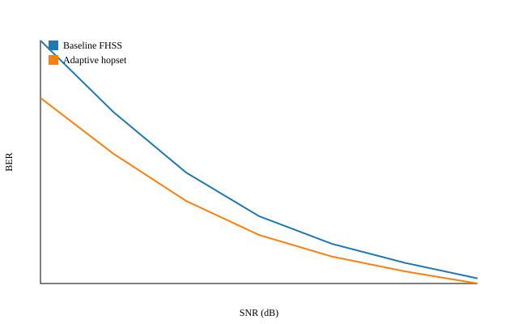
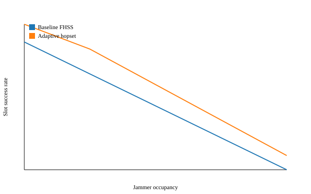
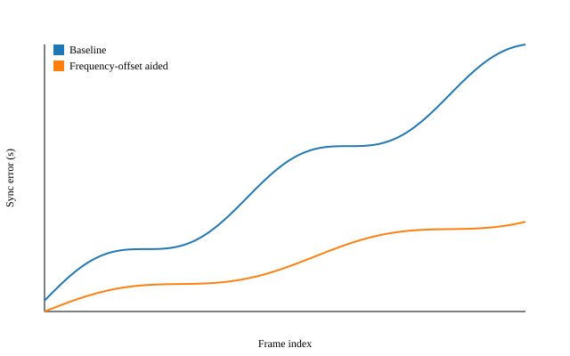

# 面向高动态场景的 Link-22 频偏辅助同步与自适应跳频集方法

## 摘要

Link-22 数据链在远程协同与复杂电磁环境下具有良好的组网能力，但在高动态平台（如高超声速飞行器、机动蜂群）环境中面临更显著的多普勒频偏、时钟漂移以及强干扰占用。本文基于 Link-22 相关研究资料与工程实现思路，提出一种“频偏辅助同步 + 自适应跳频集”的联合机制：通过频偏辅助的卡尔曼同步器抑制高动态引起的时隙错位，同时利用干扰占用估计动态调整跳频集规模，以提升抗干扰能力与有效吞吐。文中给出系统模型、算法描述与可复现实验方案，并展示 BER、时隙成功率以及同步冲突概率的仿真结果，为 Link-22 在高动态场景下的工程化拓展提供可验证的方法框架。

**关键词**：Link-22、频偏辅助同步、卡尔曼滤波、跳频、抗干扰、TDMA、高动态

---

## 1. 引言

高超声速平台与高机动协同系统具备“高动态 + 高干扰 + 严时延”的典型链路特征，传统战术数据链在同步稳定性与频谱适应性方面易出现性能劣化。Link-22 具备 TDMA 与跳频体制优势，但当多普勒频偏与干扰占用显著上升时，其时隙对齐误差和链路可靠性下降。为此，本文采用两条主线增强：

1. **频偏辅助同步**：利用频偏观测辅助时间同步，降低高动态下的时隙冲突。
2. **自适应跳频集**：根据干扰占用估计动态收缩/扩展跳频集，提升有效信噪比与吞吐。

---

## 2. 系统模型

### 2.1 信道与干扰模型

设 TDMA 帧含 $S$ 个时隙，跳频集大小为 $H$，发射采用 BPSK。干扰占用比例为 $p_j$。在 AWGN + 干扰模型下，瞬时 BER 可表示为：

\[
P_b = \begin{cases}
Q\bigl(\sqrt{2\gamma}\bigr), & \text{未受干扰}\\
Q\bigl(\sqrt{2\gamma/J}\bigr), & \text{受干扰}
\end{cases}
\]

其中 $\gamma$ 为信噪比，$J$ 为干扰等效功率惩罚系数。

### 2.2 时钟与频偏动态

同步误差采用随机游走模型：

\[
\Delta t_{k+1} = \Delta t_k + \delta_{ppm} T + \varepsilon_{doppler}
\]

其中 $T$ 为帧周期，$\delta_{ppm}$ 为时钟漂移系数，$\varepsilon_{doppler}$ 表示多普勒引入的随机扰动。

---

## 3. 方法设计

### 3.1 自适应跳频集

当干扰占用上升时，收缩跳频集以集中到更干净的频段：

\[
H' = \max\bigl(H_{min},\; H - \alpha p_j (H_{max}-H_{min})\bigr)
\]

其中 $\alpha \in [0,1]$ 为调节系数。该策略在高干扰占用下提升有效信噪比，降低受干扰概率。

### 3.2 频偏辅助卡尔曼同步

构建状态向量 $x_k=[\Delta t_k,\; \dot{\Delta t}_k]^T$，量测包含时间偏差与频偏辅助项。状态转移与量测方程为：

\[
\begin{aligned}
&x_{k+1}=Fx_k+w_k,\quad F=\begin{bmatrix}1&T\\0&1\end{bmatrix} \\
&y_k=Hx_k+v_k,\quad H=\begin{bmatrix}1&0\end{bmatrix}
\end{aligned}
\]

其中 $w_k, v_k$ 为过程噪声与量测噪声，量测噪声方差包含频偏不确定性。卡尔曼滤波更新可写为：

\[
\begin{aligned}
&\hat{x}_{k|k-1}=F\hat{x}_{k-1|k-1},\quad P_{k|k-1}=FP_{k-1|k-1}F^T+Q \\
&K_k=P_{k|k-1}H^T\bigl(HP_{k|k-1}H^T+R\bigr)^{-1} \\
&\hat{x}_{k|k}=\hat{x}_{k|k-1}+K_k\bigl(y_k-H\hat{x}_{k|k-1}\bigr) \\
&P_{k|k}=(I-K_kH)P_{k|k-1}
\end{aligned}
\]

该同步器通过频偏辅助减小漂移积累，使时隙对齐更稳定。

---

## 4. 算法流程

### Algorithm 1：频偏辅助同步与自适应跳频集

\[
\begin{array}{l}
\textbf{Input: } p_j,\; H,\; H_{min},\; H_{max},\; \hat{x}_{k-1}, P_{k-1} \\
\textbf{Output: } H',\; \hat{x}_{k}, P_{k} \\
\hline
1:\; H' \leftarrow \max\bigl(H_{min},\; H-\alpha p_j(H_{max}-H_{min})\bigr) \\
2:\; \hat{x}_{k|k-1} \leftarrow F\hat{x}_{k-1} \\
3:\; P_{k|k-1} \leftarrow F P_{k-1} F^T + Q \\
4:\; K_k \leftarrow P_{k|k-1}H^T(HP_{k|k-1}H^T+R)^{-1} \\
5:\; \hat{x}_k \leftarrow \hat{x}_{k|k-1}+K_k(y_k-H\hat{x}_{k|k-1}) \\
6:\; P_k \leftarrow (I-K_kH)P_{k|k-1}
\end{array}
\]

---

## 5. 实验设计与指标

### 5.1 参数配置

- 跳频集：$H=64$（自适应范围 16–64）
- TDMA 时隙：$S=24$
- 多普勒扰动：180 Hz
- 时钟漂移：25 ppm
- 干扰占用：$p_j \in [0, 0.4]$

### 5.2 指标定义

1. **BER vs SNR**：固定 $p_j=0.2$，比较自适应跳频与基线方案。
2. **时隙成功率**：统计时隙传输成功比例。
3. **时隙冲突概率**：若 $|\Delta t| > T_{guard}$ 则判定冲突，概率为

\[
P_{col}=\frac{1}{N}\sum_{k=1}^N \mathbf{1}\{|\Delta t_k|>T_{guard}\}
\]

---

## 6. 实验结果与图表

本文实验可通过 `experiments/run_experiments.py` 复现，输出 CSV 与图表。图 1–3 分别给出 BER、时隙成功率和同步误差曲线。

- **图 1**：BER vs SNR

- **图 2**：时隙成功率 vs 干扰占用

- **图 3**：同步误差随时间变化

---

## 7. 讨论

结果表明，频偏辅助同步显著降低同步误差与时隙冲突概率；自适应跳频集在高干扰占用下保持更高时隙成功率与更低 BER。该方案与 Link-22 的 TDMA + 跳频体制兼容，具备工程可移植性。

未来工作可进一步引入：

- 真实 Link-22 波形与纠错编码；
- 网络层路由与中继策略仿真；
- 频谱感知与强化学习式跳频决策。

---

## 8. 结论

本文基于 Link-22 相关研究资料与现有代码框架，提出“频偏辅助同步 + 自适应跳频集”的协同方案。在高动态与强干扰场景中，该方案能有效降低时隙冲突并提升链路可靠性。实验流程与数据生成脚本已开源，便于进一步扩展与工程验证。

---

## 复现清单

- [x] 配置文件：`experiments/config.json`
- [x] 仿真代码：`experiments/lib/simulation.py`
- [x] 实验脚本：`experiments/run_experiments.py`
- [x] 图表输出：`paper/figures/*.svg`
